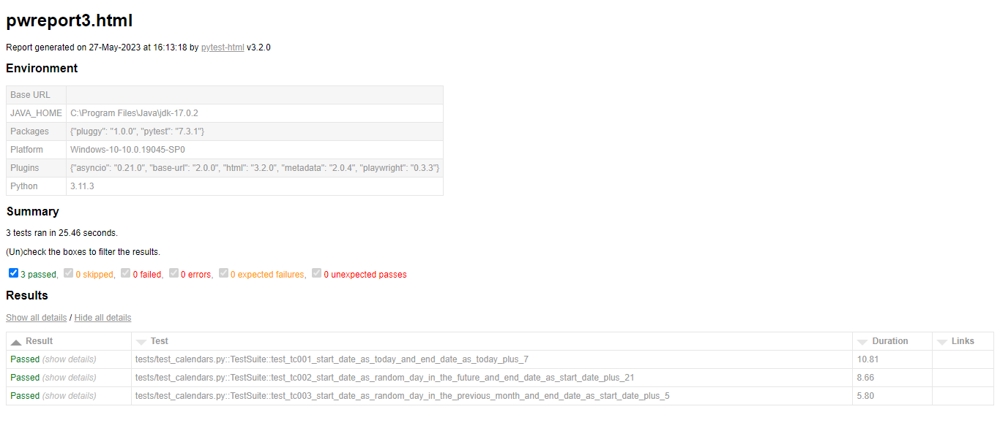

# Calendar Automated UI Tests
> Automatic UI tests for a calendar in a web app. The tested web page consists of two calendars that visually display the days between 2 selected dates.

## Table of contents
* [General info](#general-info)
* [Technologies](#technologies)
* [Setup](#setup)
* [Launch](#launch)
* [Other recommended commands](#other-recomended-commands)
* [Reporter screenshots](#reporter-screenshots)
* [Report of all test](#all-test-report)
* [Detail of the tests report](#detail-test-report)
* [Activated generation of detailed screenshots](#activated-generation-detailed-screenshots)
* [Project status](#project-status)

## General Info
This proyect is about automated UI tests with Playwright and Python, using the design pattern POM (page object model). This proyect include Pylint for linting. The system tested is a calendar web app in which 2 dates can be selected using one or two calendars displayed.

## Technologies
Project is created with:

- Python v3.11.3.
- Playwright v1.33.0 (library for browser automation).
- Pytest v7.3.1 (test framework).
- Pylint v2.17.4 (linter).
- Python-dateutil v2.8.2 (extension module).
- Pytest-playwright v0.3.3 (plugin).
- Pytest-html v3.2.0 (plugin).

## Setup
Clone this repo to desktop (or other place). You must have python 3 and pip installed on your operating system then you have to activate the virtual environment, for this run de command `venv\Scripts\activate ` (on Windows OS) or `source venv/bin/activate` (on Unix/macOS OS) and run `py -m pip install -r requirements.txt` (if you are using Windows OS, else replace "py" for "python") to install all the dependencies.

After the Python packages are installed, you need to install the browsers for Playwright. The playwright install command installs the latest versions of the three browsers that Playwright supports: Chromium, Firefox, and WebKit. The command is `playwright install`.

## Launch
After you clone this repo to your desktop (or other place) and installed their dependencies you have to activate the virtual environment, for this run de command `venv\Scripts\activate ` (on Windows OS) or `source venv/bin/activate` (on Unix/macOS OS).

Once the virtual environment is up, go to the **"pom"** folder you can run some of this commands:

- `python -m pytest -s -v --headed --html=reports/pwreport3.html --capture=tee-sys`: it is used to run the tests. In the end a HTML report will be generated in the folder "reports".
- `python -m pytest tests`: it is used to run tests in headedless mode (the browser is not displayed).
- `python -m pytest tests --headed`: it is used to run tests in headed mode (the browser is displayed).
- `python -m pytest tests --screenshot on`: it is used to run tests and capture screenshots at the end of each test. The screenshots are saved as PNG files under a directory named test-results. You can change the output directory using the `--output option`.
- `python -m pytest tests --screenshot only-on-failure`: it is used to run tests and capture screenshots for every failing test only.
- `python -m pytest tests --video on`: it is used to run tests and generate a video for each test as WebM files in the output directory. 
- `python -m pytest tests --video retain-on-failure`: it is used to run tests and generate a video ffor every failing test only as WebM files in the output directory. 

By default the tests are run with the Chromium browser, to change the browser used test with the following commands:

- `python -m pytest tests --browser chromium`: test are run with Chromium browser.
- `python -m pytest tests --browser firefox`: test are run with Firefox browser.
- `python -m pytest tests --browser webkit`: test are run with Webkit browser.
- `python -m pytest tests --browser chromium --browser firefox --browser webkit --verbose`: test are run with Chromium, Firefox and Webkit browsers.

You may want to append --headed --slowmo 1000 so you can actually see the automation at work.

### Other Recommended Commands:
In case of a new module or library is installed you should run the command `py -m pip freeze` (on Windows OS) or `python3 -m pip freeze` (on Unix/macOS OS) to generated a list of  of all installed packages and their versions. Replace the content of the file "requirements.txt" with this list. In this way a consistent control of the dependencies is maintained.

To run the linter go to the **root directory** of the project and use the command `pylint pom`, this will run the linter in the pom folder.

## Reporter Screenshots
After running the tests with the command `python -m pytest -s -v --headed --html=reports/pwreport3.html --capture=tee-sys` a HTML report will be generated, to see it go to the folder **pom/reports** and open the html file in your browser. Here are some screenshots of the report:
### Report of all test

### Detail of the tests report

## Activate generation of detailed screenshots
To generated screenshots of each key part of the tests go to **pom/data/constants.py** and replace the value False for True of the **FULL_SCREENSHOT** variable. Then after a run of the tests go to the **pom/screenshots** to see the generated screenshots.

## Project status
Project is: _in progress_ 

